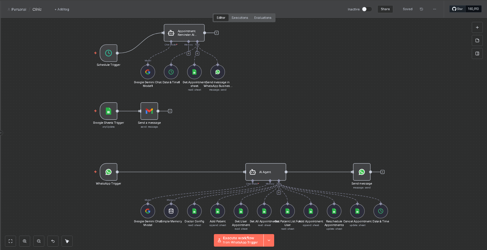

# 🏥 AI-Powered Clinic Intelligence System

> An advanced healthcare automation system built on **n8n**, utilizing **AI Agents (Gemini)** to manage the entire patient lifecycle via WhatsApp and Google Sheets.

## ✨ Key System Capabilities (As seen in Workflow)

### 🤖 1. Autonomous Appointment Management
* **Dynamic Scheduling:** Patients can book, reschedule, or cancel appointments directly via WhatsApp.
* **AI Intent Recognition:** Uses **Gemini 1.5** to understand natural language and extract dates/times.
* **Tool-Use (Agentic AI):** The AI Agent is equipped with specific tools to:
    * `Get User Appointment`
    * `Add Appointment`
    * `Reschedule/Cancel Appointments`
    * `Read Doctor Configuration`

### 📢 2. Proactive Patient Engagement
* **Automated Reminders:** A scheduled trigger checks the database and sends personalized WhatsApp reminders to patients.
* **Instant Sync:** Detects manual changes in Google Sheets and triggers immediate Gmail notifications.

## 📊 Visual Workflow Architecture

## 🛠️ Tech Stack
* **Orchestration:** n8n.io
* **LLM:** Google Gemini (Generative AI)
* **Channels:** WhatsApp Business API, Gmail
* **Database:** Google Sheets (CRM)
* **Logic:** Node-based Agentic Workflow with Memory

---
## 🎥 Project Demo
Check out the full system in action on my [Personal Portfolio](https://karimmontaser0.github.io/My_Portfolio/).
